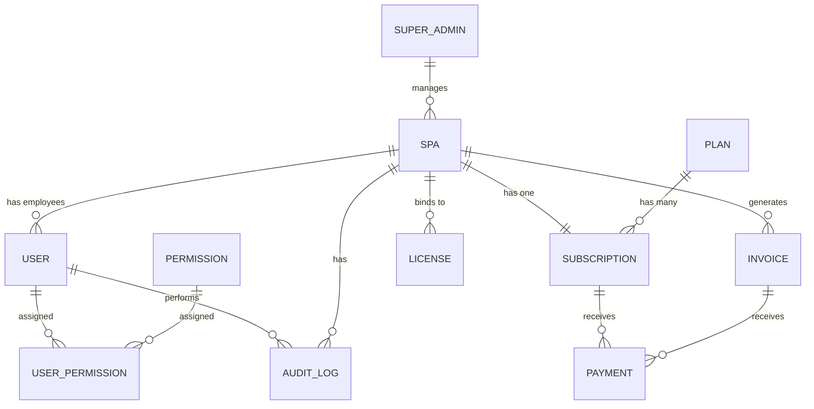

# Phase 1: SaaS Foundation & Multi-Tenant Architecture

## 1. ER Diagram


## 2. API Structure (Super Admin)
```
/api/v1
  /auth
    POST /login
    POST /logout
    POST /register-super-admin (disabled in production)
    
  /spas
    POST /             - Create Spa
    GET /              - List Spas
    GET /:id           - Get Spa Details
    PUT /:id           - Update Spa
    PATCH /:id/status  - Suspend/Activate/Block Spa
    DELETE /:id        - Delete Spa

  /subscriptions
    POST /:spaId/plan  - Assign Plan
    GET /:spaId        - Get Subscription details
    PATCH /:spaId      - Update Trial/Status

  /plans
    GET /              - List Plans
    POST /             - Create Plan
    PUT /:id           - Update Plan

  /licenses
    POST /             - Generate License Keys
    GET /              - List Licenses
    PATCH /:id/status  - Revoke/Activate License

  /payments
    GET /              - Verify Payments / Billing History
```

## 3. Folder Structure
```
backend/
├── prisma/
│   └── schema.prisma        # Database schema
├── src/
│   ├── config/              # Environment vars & configs
│   ├── controllers/         # Request handlers
│   ├── middlewares/         # Express middlewares (auth, errors)
│   ├── routes/              # API route definitions
│   ├── services/            # Business logic
│   ├── utils/               # Helpers, Logger, Prisma client
│   ├── app.ts               # Express app setup
│   └── index.ts             # Server entry point
├── package.json
└── tsconfig.json
```

## 4. RBAC Architecture (Role-Based Access Control)
- **Roles**: Super Admin, Spa Owner, Manager, Receptionist, Therapist, Accountant.
- **Permissions**: Granular control via `Permission` and `UserPermission` tables.
- **Implementation**: The `authorize(...roles)` middleware checks the JWT payload for the user's role. For granular permissions, a separate `hasPermission(permissionCode)` middleware checks the database or a cached Redis store.

## 5. Authentication Flow
1. User logs in with `email` and `password`.
2. Backend validates credentials using `bcrypt` against the database.
3. Backend generates a `JWT` containing `id`, `role`, and `spaId`.
4. Token is sent via an `HttpOnly` cookie for security.
5. All protected routes require the `authenticate` middleware, which verifies the JWT signature and extracts the payload into `req.user`.

## 6. Tenant Isolation Strategy
- **Logical Isolation**: A single PostgreSQL database is used. Every tenant-specific table (e.g., `Users`, `Invoices`, `Subscriptions`) has a `spaId` foreign key.
- **Query Filtering**: Prisma queries for tenant data will always include `where: { spaId: req.user.spaId }` to prevent data leakage.
- **Super Admin Bypass**: Super Admins have `spaId = null` and can query all records, bypassing the `spaId` filter.

## 7. Security Architecture
- **Helmet**: Secures HTTP headers.
- **CORS**: Restricted to specific origins (frontend app).
- **Rate Limiting**: (To be implemented) Prevents brute-force attacks on login endpoints.
- **HttpOnly Cookies**: Prevents XSS attacks from reading the JWT.
- **Bcrypt**: Hashes passwords with a work factor of 12.
- **Audit Logs**: Tracks sensitive actions (creates, updates, deletes) in the `AuditLog` table.
